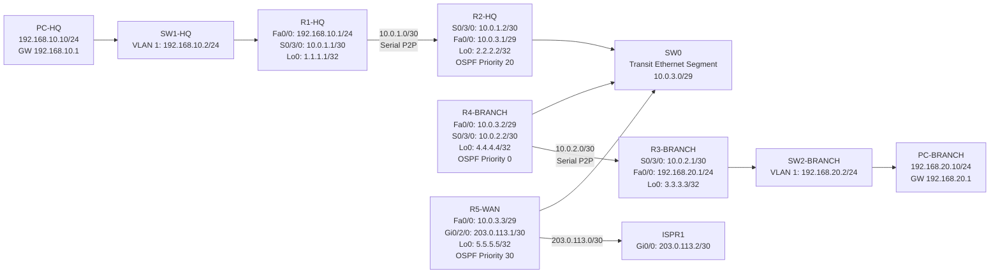

# CCNA Project 03 – Multi-Segment OSPF Routing Design with DR/BDR Election and Default Route Origination

## Overview
This project demonstrates a multi-router OSPF design built in Cisco Packet Tracer to study how OSPF behaves across different interface types and network segments.

The topology was intentionally redesigned beyond a basic 3-router branch-to-HQ lab so I could observe and document:

- OSPF over serial point-to-point links
- OSPF over Ethernet broadcast multiaccess segments
- DR/BDR election behavior
- OSPF interface priority effects
- OSPF simple authentication
- loopback advertisement
- passive-interface behavior
- default route origination from a WAN-edge router

The project simulates an HQ site, a Branch site, an internal transit segment, and a WAN-edge router connected to a simulated ISP.

---

## Objectives
- Build a multi-segment routed topology in Cisco Packet Tracer
- Configure single-area OSPF (Area 0) across serial and Ethernet links
- Compare point-to-point serial OSPF behavior versus Ethernet broadcast OSPF behavior
- Validate OSPF neighbor formation and route learning
- Observe DR/BDR election on a shared Ethernet segment
- Validate OSPF authentication on active transit links
- Originate a default route from the WAN edge into OSPF
- Document baseline, failure, and recovery behavior in a portfolio-ready format

---

## Physical Topology

The image below shows the actual Cisco Packet Tracer topology used in this project.

---

## Logical Topology

The diagram below shows the logical routed design used in this project.

---

## Device Roles
- R1-HQ – default gateway for the HQ LAN
- R2-HQ – HQ-side transit router connected to the serial WAN link and shared Ethernet OSPF segment
- R3-BRANCH – default gateway for the Branch LAN
- R4-BRANCH – branch-side transit router connected to the branch serial WAN link and shared Ethernet OSPF segment
- R5-WAN – WAN-edge router connected to the internal Ethernet OSPF segment and simulated ISP
- ISPR1 – simulated upstream ISP router
- SW1-HQ – Layer 2 switch for HQ LAN
- SW2-BRANCH – Layer 2 switch for Branch LAN
- SW0 – shared Ethernet transit switch for the OSPF broadcast segment

---

## IP Addressing Plan
### HQ LAN
- Network: `192.168.10.0/24`
- R1-HQ Fa0/0: `192.168.10.1`
- SW1-HQ VLAN 1: `192.168.10.2`
- PC-HQ: `192.168.10.10`
- Default gateway: `192.168.10.1`

### Branch LAN
- Network: `192.168.20.0/24`
- R3-BRANCH Fa0/0: `192.168.20.1`
- SW2-BRANCH VLAN 1: `192.168.20.2`
- PC-BRANCH: `192.168.20.10`
- Default gateway: `192.168.20.1`

### Serial Point-to-Point Links
- R1-HQ to R2-HQ
  - Network: `10.0.1.0/30`
  - R1-HQ S0/3/0: `10.0.1.1`
  - R2-HQ S0/3/0: `10.0.1.2`
- R4-BRANCH to R3-BRANCH
  - Network: `10.0.2.0/30`
  - R3-BRANCH S0/3/0: `10.0.2.1`
  - R4-BRANCH S0/3/0: `10.0.2.2`

### Ethernet OSPF Transit Segment
- Network: `10.0.3.0/29`
- R2-HQ Fa0/0: `10.0.3.1`
- R4-BRANCH Fa0/0: `10.0.3.2`
- R5-WAN Fa0/0: `10.0.3.3`

### ISP Link
- Network: `203.0.113.0/30`
- R5-WAN Gi0/2/0: `203.0.113.1`
- ISPR1 Gi0/0: `203.0.113.2`

### Loopbacks
- R1-HQ Lo0: `1.1.1.1/32`
- R2-HQ Lo0: `2.2.2.2/32`
- R3-BRANCH Lo0: `3.3.3.3/32`
- R4-BRANCH Lo0: `4.4.4.4/32`
-  R5-WAN Lo0: `5.5.5.5/32`

---

## Routing Design
- Routing protocol: OSPF
- Process ID: 1
- Area: 0
- Design type: Single-area OSPF
- Internal routing domain: Area 0 only
- External connectivity: default route originated by R5-WAN

## OSPF Design Notes
- LAN-facing interfaces were configured as passive where appropriate
- Loopback interfaces were advertised and used as stable router IDs
- OSPF authentication was enabled on active transit links
- Serial links were used to validate point-to-point OSPF behavior
- Ethernet transit was used to validate broadcast multiaccess OSPF behavior
- R5-WAN acted as an ASBR and originated the default route into OSPF

---

## OSPF Behavior Observed
### 1. OSPF over Serial Point-to-Point

The following links behaved as point-to-point OSPF adjacencies:
- R1-HQ ↔ R2-HQ
- R4-BRANCH ↔ R3-BRANCH

Observed behavior:
- direct FULL adjacency formation
- no DR/BDR election
- expected point-to-point route propagation

### 2. OSPF over Ethernet Broadcast Multiaccess

The shared Ethernet segment 10.0.3.0/29 connected:
- R2-HQ
- R4-BRANCH
- R5-WAN

Observed behavior:
- DR/BDR election occurred
- multiple neighbors formed on the shared segment
- route exchange happened through the broadcast network type

### 3. DR/BDR Election Results

Configured priorities:
- R5-WAN = 30
- R2-HQ = 20
- R4-BRANCH = 0

Validated results:
- R5-WAN = DR
- R2-HQ = BDR
- R4-BRANCH = DROTHER

This confirmed that:
- higher OSPF priority influences election
- an interface with priority 0 cannot become DR or BDR

### 4. Default Route Origination

R5-WAN was configured with:
- a static default route toward ISPR1
- default-information originate under OSPF

Result:
- internal routers installed O*E2 0.0.0.0/0
- the default route was successfully propagated across the OSPF domain

### 5. OSPF Authentication

OSPF simple authentication was configured on active transit interfaces.

Result:
- adjacencies formed successfully only when authentication settings matched
- this reinforced the dependency between OSPF control-plane formation and matching interface security settings

---

## Baseline Validation Summary
### Interface Status

Validated that all required active interfaces were operational:
- HQ LAN interfaces up/up
- Branch LAN interfaces up/up
- serial transit links up/up
- Ethernet OSPF segment interfaces up/up
- WAN-edge ISP-facing interface up/up

### Neighbor Status

Validated:
- R1-HQ formed FULL adjacency with R2-HQ
- R3-BRANCH formed FULL adjacency with R4-BRANCH
- R2-HQ, R4-BRANCH, and R5-WAN formed expected adjacencies on the Ethernet segment

### Route Learning

Validated:
- HQ LAN and Branch LAN were learned dynamically through OSPF
- loopbacks were learned across the topology
- internal routers learned the external default route from R5-WAN

### End-to-End Connectivity

Validated:
- PC-to-default-gateway reachability
-HQ-to-Branch host reachability
- Branch-to-HQ host reachability
- default route installation on internal routers

---

### Failure Testing Scope
This project includes the following failure and recovery scenarios:

- Failure Test 1 – R1-HQ to R2-HQ serial link down
- Recovery Test 1 – restore R1-HQ to R2-HQ serial link
- Failure Test 2 – R4-BRANCH to R3-BRANCH serial link down
- Recovery Test 2 – restore R4-BRANCH to R3-BRANCH serial link
- Failure Test 3 – R5-WAN Ethernet uplink to internal OSPF segment down
- Recovery Test 3 – restore R5-WAN Ethernet uplink

These tests allow observation of:
- site isolation due to point-to-point serial failure
- route withdrawal and neighbor loss
- loss and restoration of default-route origination from the WAN edge
- internal versus external reachability differences

---

## Lessons learned

- How OSPF behaves differently on serial point-to-point links versus Ethernet multiaccess segments
- That point-to-point serial OSPF links form direct adjacencies without DR/BDR election
- That Ethernet broadcast OSPF segments elect a Designated Router (DR) and Backup Designated Router (BDR)
- How `ip ospf priority` affects DR/BDR election outcomes
- That an interface with `ip ospf priority 0` can still form adjacency but will never be elected DR or BDR
- How loopback interfaces can be used for stable router IDs and additional route validation
- How passive interfaces allow route advertisement without forming unnecessary OSPF adjacencies on user-facing LANs
- How OSPF simple authentication must match on both ends of participating interfaces for adjacencies to form
- How a static default route can be injected into OSPF with `default-information originate`
- How to validate OSPF using interface state, neighbor state, routing tables, and default-route entries
- How to distinguish internal routing continuity from WAN-edge default-route dependency

## Tools Used
- Cisco Packet Tracer
- Cisco IOS CLI
- Markdown documentation
- Screenshot-based validation
- Mermaid.js logical topology diagram
