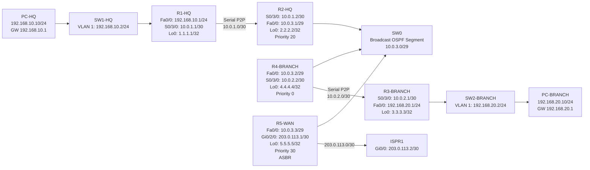

## Logical Topology

```mermaid
flowchart LR
    PCHQ[PC-HQ\n192.168.10.10/24\nGW 192.168.10.1]
    SWHQ[SW1-HQ\nVLAN 1: 192.168.10.2/24]
    R1[R1-HQ\nFa0/0: 192.168.10.1/24\nS0/3/0: 10.0.1.1/30\nLo0: 1.1.1.1/32]
    R2[R2-HQ\nS0/3/0: 10.0.1.2/30\nFa0/0: 10.0.3.1/29\nLo0: 2.2.2.2/32\nPriority 20]
    SWT[SW0\nBroadcast OSPF Segment\n10.0.3.0/29]
    R4[R4-BRANCH\nFa0/0: 10.0.3.2/29\nS0/3/0: 10.0.2.2/30\nLo0: 4.4.4.4/32\nPriority 0]
    R5[R5-WAN\nFa0/0: 10.0.3.3/29\nGi0/2/0: 203.0.113.1/30\nLo0: 5.5.5.5/32\nPriority 30\nASBR]
    ISP[ISPR1\nGi0/0: 203.0.113.2/30]
    R3[R3-BRANCH\nS0/3/0: 10.0.2.1/30\nFa0/0: 192.168.20.1/24\nLo0: 3.3.3.3/32]
    SWBR[SW2-BRANCH\nVLAN 1: 192.168.20.2/24]
    PCBR[PC-BRANCH\n192.168.20.10/24\nGW 192.168.20.1]

    PCHQ --> SWHQ
    SWHQ --> R1
    R1 -->|Serial P2P\n10.0.1.0/30| R2
    R2 --> SWT
    R4 --> SWT
    R5 --> SWT
    R4 -->|Serial P2P\n10.0.2.0/30| R3
    R3 --> SWBR
    SWBR --> PCBR
    R5 -->|203.0.113.0/30| ISP
```
