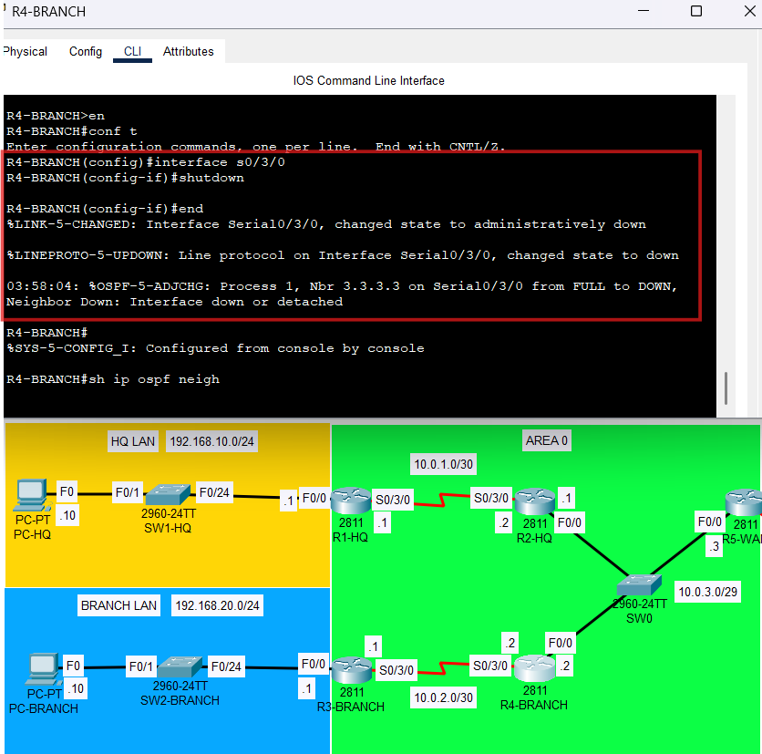
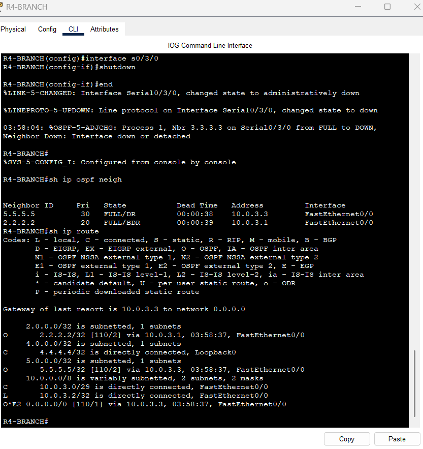
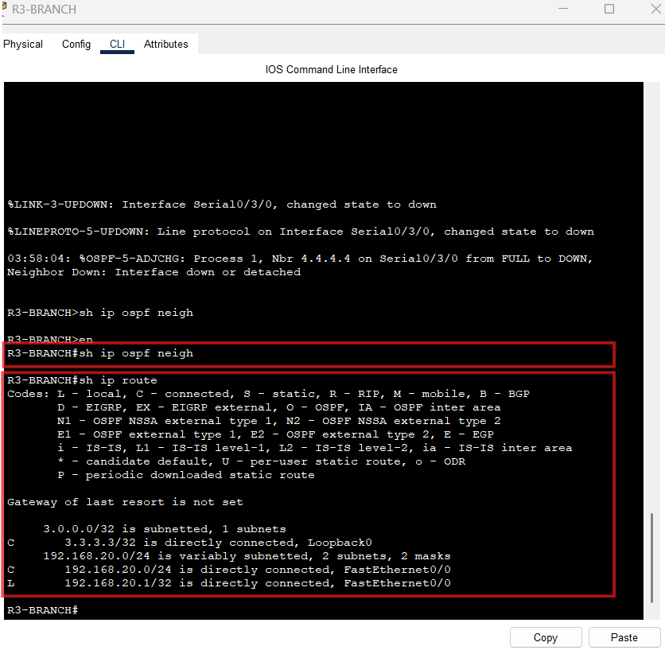
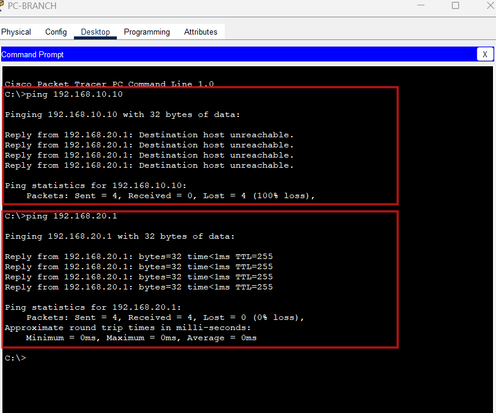

# Failure Test 2 – R4-BRANCH to R3-BRANCH Serial Link Down

## Objective
Simulate failure of the Branch-side point-to-point serial OSPF link and observe route loss and site isolation effects.

---

## Failure Action
Shutdown performed on either:
- **R4-BRANCH Serial0/3/0**
or
- **R3-BRANCH Serial0/3/0**

### Command Used
- `interface s0/3/0`
- `shutdown`

---

## Expected Outcome
- OSPF adjacency between R4-BRANCH and R3-BRANCH drops
- Branch LAN becomes isolated from HQ and WAN-edge routes
- R3-BRANCH loses remote OSPF routes and default route
- internal Ethernet OSPF segment between R2-HQ, R4-BRANCH, and R5-WAN remains functional

---

## Verification Commands
- `show ip ospf neighbor`
- `show ip route`
- ping from PC-BRANCH to PC-HQ

---

## Expected Observations
- R3-BRANCH loses its only OSPF neighbor
- Branch router loses learned remote routes
- default route disappears from R3-BRANCH
- PC-BRANCH cannot reach HQ LAN

---

## Actual Result
The failure was successfully reproduced by shutting down `Serial0/3/0` on R4-BRANCH.

Observed results:
- R4-BRANCH reported the OSPF adjacency to R3-BRANCH going from FULL to DOWN
- R4-BRANCH no longer displayed R3-BRANCH as an OSPF neighbor
- R4-BRANCH still maintained OSPF adjacencies with R2-HQ and R5-WAN on the Ethernet broadcast segment
- R4-BRANCH lost Branch-side route reachability while retaining Ethernet-segment reachability and the external default route
- R3-BRANCH lost its only OSPF neighbor and no longer displayed any OSPF neighbor entries
- R3-BRANCH lost all remote OSPF-learned routes, including:
  - HQ LAN reachability
  - internal transit network reachability
  - remote loopbacks
  - external default route
- PC-BRANCH could still reach its local default gateway `192.168.20.1`
- PC-BRANCH could no longer reach PC-HQ `192.168.10.10`
- ping failure returned `Destination host unreachable` from `192.168.20.1`, confirming the Branch gateway no longer had a route to the remote network
  
---

## Conclusion
Failure Test 2 behaved as expected.

Shutting down the point-to-point serial link between R4-BRANCH and R3-BRANCH caused the branch-side OSPF adjacency to fail and isolated R3-BRANCH from the rest of the OSPF domain. R3-BRANCH lost all remotely learned routes and the external default route, while R4-BRANCH continued to participate in the Ethernet broadcast segment with R2-HQ and R5-WAN. This confirmed that Branch LAN reachability depends entirely on the R4-BRANCH-to-R3-BRANCH serial link.

---

## Evidence (Screenshots)
- 
  
- 

- 

- 
